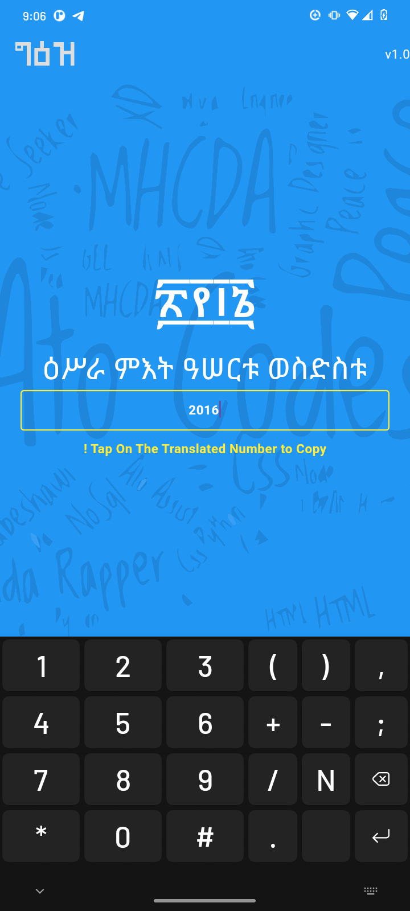

## Geez Nums Flutter App (v1.0.0)

Geez Nums - አማርኛ ቁጥር መለወጫ (Arabic ↔ Ethiopic Amharic). With simple UI and scalable project structure that goes beyond simple coversion.

The app has basic strightforward usage, type your number in the input and get the result. It comes with not only number but the actual name as well.

Which The Conversion Algorythm Developed By [Ato Codes](https://github.com/atocodes)

## **Features:**

- Convert Any [Arabic Numbers]() => (eg: 1,2,453,2016) to [Geez Numbers]() with names => (፩ ኣሓዱ, ፪ ክልኤቱ, ፬፻፶፫ ኣርባዕቱ ምእት ሓምሳ ወሠለስቱ, ፬፻፶፫ ኣርባዕቱ ምእት ሓምሳ ወሠለስቱ)

## **Installation:**

## **For Developers:**

1. Clone the repository and run `flutter pub get` to install dependencies.

```
flutter pub get
```

then run flutter launcher icon

```
flutter pub run flutter_launcher_icons
```

## **Technical Details:**

- Flutter Version: 3.19.3
- Dependencies:
  - flutter_launcher_icons: ^0.13.1
  - font_awesome_flutter: ^10.5.0
  - url_launcher: ^6.1.14

### Screenshots

<br />
<div>
  &emsp;&emsp;&emsp;
  
  &emsp;&emsp;&emsp;&emsp;
    
</div>
<br />

## **License:**

MIT License
